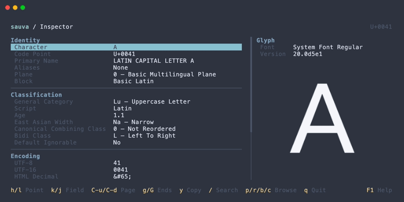
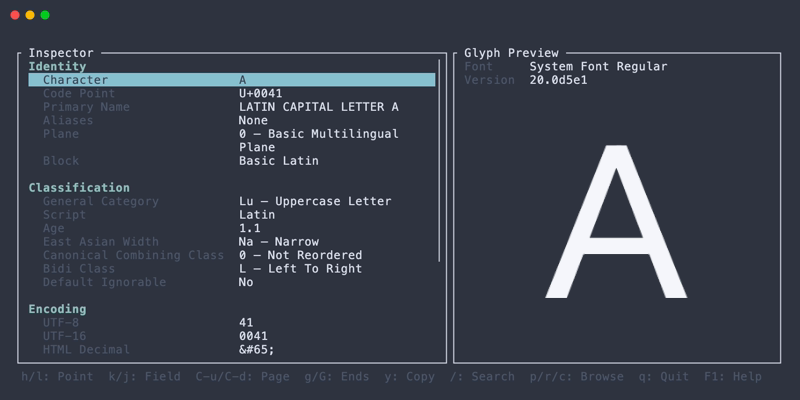
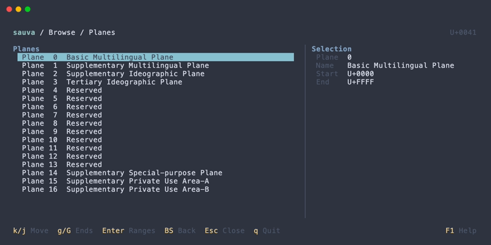
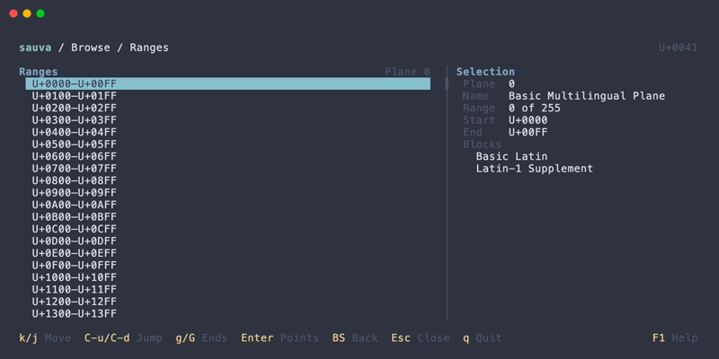
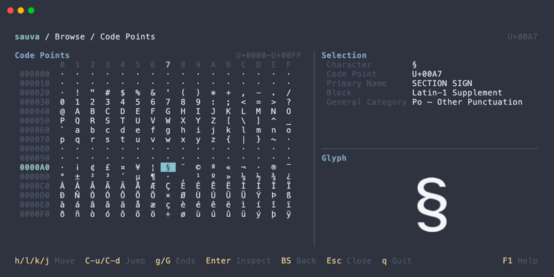
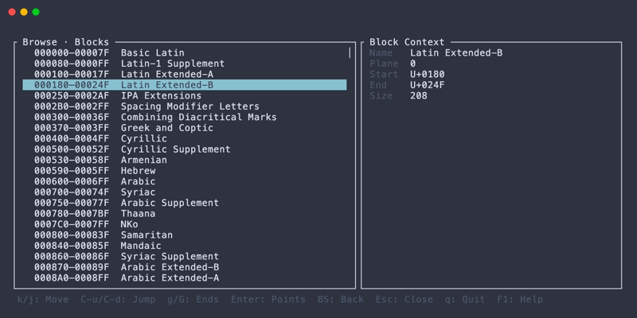
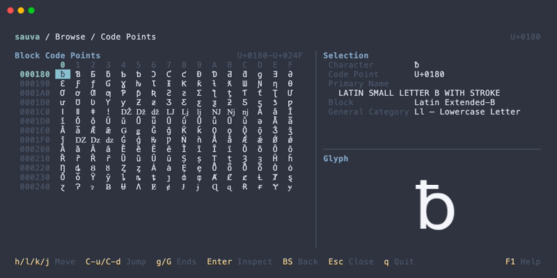
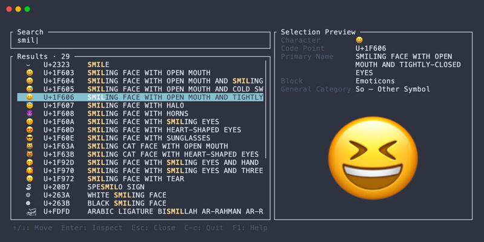
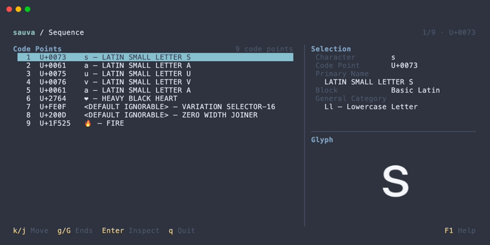
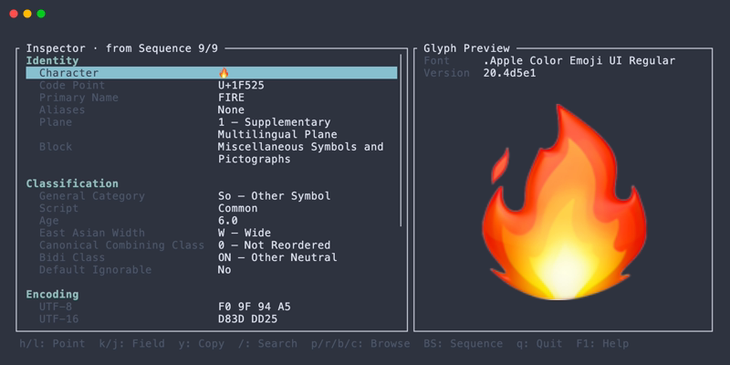

# Sauva

[](https://crates.io/crates/sauva)
[](https://ratatui.rs)

Terminal Unicode Explorer 🪄



## About

Sauva is a terminal application for searching and browsing Unicode code points. It shows Unicode properties and a glyph preview in a responsive TUI.

The bundled data is based on Unicode 17.0.0.

## Installation

### [Cargo](https://crates.io/crates/sauva)

```
cargo install --locked sauva
```

### [Homebrew (macOS)](https://github.com/lusingander/homebrew-tap/blob/master/sauva.rb)

```
brew install lusingander/tap/sauva
```

### Downloading a binary

Pre-built binaries are available from the [releases page](https://github.com/lusingander/sauva/releases).

## Usage

### Basic

Run sauva without arguments to open the default code point:

```
sauva
```

### Options

```
Sauva - Terminal Unicode Explorer 🪄

Usage: sauva [OPTIONS] [INPUT]

Arguments:
  [INPUT]  Text or code point to inspect

Options:
  -t, --text <TEXT>           Treat the input as literal text, without code point notation parsing
  -g, --graphics <MODE>       Control glyph preview graphics [default: auto] [possible values: auto, force, iterm2, off]
      --print-default-config  Print the complete default configuration to standard output
  -h, --help                  Print help
  -V, --version               Print version
```

#### Specifying `INPUT`

One character opens its code point directly in the Inspector. A sequence of characters opens the Sequence view, where each constituent code point can be selected and inspected.

The Sequence view groups rows by extended grapheme cluster. A muted gutter shows cluster numbers and boundaries (`•` for a single code point, `┌│└` for multiple code points). Selection highlighting and `ui.selection_cursor` apply only to the row body, leaving the cluster gutter unchanged. Navigation and glyph previews remain code-point-based.

```
sauva あ
sauva 'Á👩‍💻'
```

Code points can also be given in `U+` notation, `0x` notation, or as two to six hexadecimal digits.

```
sauva U+2192
sauva 0x1F600
sauva 1F600
```

A one-character argument is treated as the character itself. Use a prefix for a one-digit hexadecimal value, such as `U+A` or `0xA`.

An input made entirely of hexadecimal digits keeps the code point interpretation. Use `--text` to force literal text when the input would otherwise be interpreted as notation:

```
sauva -t 41
sauva --text U+2192
```

`--text` still opens the Inspector directly when its value contains only one code point. Empty text is rejected.

#### `-g, --graphics <MODE>`

- `auto` enables the Kitty graphics protocol for detected kitty and Ghostty terminals.
- `force` uses the Kitty graphics protocol without terminal detection.
- `iterm2` uses the iTerm2 inline image protocol.
- `off` disables glyph images.

See [Compatibility](#compatibility) for terminal support.

### Config

sauva loads the first applicable configuration path in this order:

1. The path specified by `SAUVA_CONFIG_FILE`
2. `$XDG_CONFIG_HOME/sauva/config.toml`
3. `$HOME/.config/sauva/config.toml`

If the default file does not exist, built-in settings are used. A missing file specified by `SAUVA_CONFIG_FILE`, or an invalid configuration file, causes startup to fail.

The complete built-in configuration can be printed without starting the TUI or loading a local configuration file:

```
sauva --print-default-config
sauva --print-default-config > config.toml
```

All settings are optional. The following example shows the main configuration areas:

<details>
<summary>Configuration example</summary>

```toml
[color]
fg = "reset"
bg = "reset"
muted = "darkgray"
accent = "cyan"
heading = "blue"
border = "darkgray"
match = "yellow"
key = "yellow"
link = "blue"

[color.selection]
fg = "black"
bg = "cyan"

[color.status]
info = "green"
warning = "yellow"

[glyph_preview]
font_families = ["Iosevka", "Noto Sans"]
emoji_font_families = ["Noto Color Emoji"]
fg = "#f5f7fa"
bg = "#00000000"

[ui]
selection_cursor = "▸"
input_cursor = { text = "|" }
```

UI colors accept ANSI color names, `#RRGGBB`, or an indexed color from `0` to `255`. Glyph image colors accept `#RRGGBB` and `#RRGGBBAA`.

</details>

The complete configuration structure and defaults are defined in [config.schema.json](config.schema.json).

### Keybindings

These are the main built-in controls. The available controls depend on the current view.

| Key | Description |
| --- | --- |
| <kbd>F1</kbd> | Open or close contextual help |
| <kbd>Ctrl+c</kbd> | Quit from any view |
| <kbd>q</kbd> | Quit from the Inspector, Sequence, or Browse view |
| <kbd>Esc</kbd> | Cancel Search or Browse; quit from the Inspector or Sequence view |
| <kbd>h</kbd> <kbd>j</kbd> <kbd>k</kbd> <kbd>l</kbd> or arrow keys | Move the selection |
| <kbd>/</kbd> | Search by character, code point, Unicode name, or formal name alias |
| <kbd>p</kbd> <kbd>r</kbd> <kbd>b</kbd> <kbd>c</kbd> | Browse planes, ranges, blocks, or code points |
| <kbd>Enter</kbd> | Open the selected item; inspect a code point from Sequence or Browse |
| <kbd>Backspace</kbd> | Return to the previous Browse screen, or return from Inspector to the input Sequence |
| <kbd>y</kbd> | Copy the selected Inspector value |

Press <kbd>F1</kbd> to view all controls for the current screen.

#### Custom keybindings

Keybindings can be replaced per command and context. A command can have multiple keys, and an empty array disables it in that context.

<details>
<summary>Keybinding example and syntax</summary>

```toml
[keybindings.global]
help = ["f2"]

[keybindings.inspector]
next_code_point = ["l", "right", "n"]
back = ["backspace"]
browse_planes = []
```

Keys may be a single character, a named key such as `enter`, `esc`, `left`, or `f1`, or a modifier followed by one character, such as `ctrl-n`, `alt-j`, or `shift-g`. Conflicting and invalid bindings are rejected at startup.

See [config.schema.json](config.schema.json) for all contexts and command names.

</details>

## Compatibility

### Operating systems

macOS and Linux are supported. macOS uses Core Text for system font lookup. Linux uses Fontconfig when available and falls back to a best-effort font database lookup if Fontconfig cannot be loaded.

### Terminal emulators

Glyph previews use the [Kitty graphics protocol](https://sw.kovidgoyal.net/kitty/graphics-protocol/) and its [Unicode placeholder](https://sw.kovidgoyal.net/kitty/graphics-protocol/#unicode-placeholders) feature. The supported terminals are:

- [kitty](https://sw.kovidgoyal.net/kitty/)
- [Ghostty](https://ghostty.org)

Use `--graphics force` to try the Kitty protocol in another compatible terminal or when automatic detection does not enable it.

The [iTerm2 inline image protocol](https://iterm2.com/documentation-images.html) is available through `--graphics iterm2`, but compatibility and future support are not guaranteed. It is never selected automatically.

### Glyph preview fonts

Sauva does not bundle fonts. Available glyphs and the selected font therefore depend on the fonts installed on the system.

For each code point, sauva tries configured normal fonts, the system default text font, configured emoji fonts, and then system fallback fonts. Preferred fonts can be set with `glyph_preview.font_families` and `glyph_preview.emoji_font_families`.

## Screenshots

### Inspector



### Browse Plane / Range / Code point

  

### Browse Block

 

### Search



### Sequence

 

## License

Sauva is distributed under the [MIT License](LICENSE).

The generated Unicode data is derived from the Unicode Character Database. See [THIRD_PARTY_NOTICES](THIRD_PARTY_NOTICES.md) and the [Unicode License v3](UNICODE-LICENSE.txt) for details.
