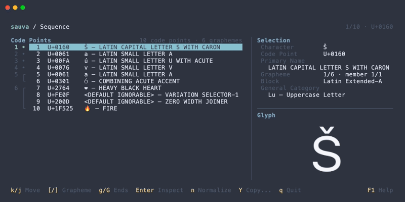

# Sauva

[](https://crates.io/crates/sauva)
[](https://ratatui.rs)

Terminal Unicode Explorer 🪄


## About

Sauva is a terminal application for searching and browsing Unicode code points. It shows Unicode properties and a glyph preview in a responsive TUI.

- Inspect Unicode properties, encodings, and decomposition mappings.
- Search by character, code point, Unicode name, or formal name alias.
- Browse planes, ranges, blocks, and code points.
- Analyze strings by code point and grapheme cluster in Sequence mode.
- Compare NFC, NFD, NFKC, and NFKD normalization forms.
- Customize colors, glyph preview fonts, and keybindings.

The bundled data is based on Unicode 17.0.0. See [Features](https://lusingander.github.io/sauva/features/) for details and screenshots.

## Documentation

For detailed usage, configuration, and terminal support, see the [full documentation](https://lusingander.github.io/sauva/).

## Installation

If you're using Cargo:

```sh
cargo install --locked sauva
```

Homebrew and pre-built binaries are also available. See [Installation](https://lusingander.github.io/sauva/getting-started/installation.html) for all options.

## Usage

### Inspect a code point

Run `sauva` without arguments, or specify a character or code point:

```sh
sauva
sauva あ
sauva U+2192
```

### Analyze text in Sequence mode

Pass a string to inspect its code points and grapheme clusters:

```sh
sauva 'Á👩‍💻'
```

Press <kbd>Enter</kbd> to inspect a selected code point, or <kbd>n</kbd> to compare normalization forms.



Use `--text` when the input would otherwise be interpreted as code point notation, or `--text -` to read literal UTF-8 text from stdin:

```sh
sauva --text 41
printf 'Á👩‍💻' | sauva --text -
```

See [Sequence](https://lusingander.github.io/sauva/features/sequence.html), [Normalization](https://lusingander.github.io/sauva/features/normalization.html), and [Basic Usage](https://lusingander.github.io/sauva/getting-started/basic-usage.html) for more examples.

### Options

```text
Sauva - Terminal Unicode Explorer 🪄

Usage: sauva [OPTIONS] [INPUT]

Arguments:
  [INPUT]  Text or code point to inspect, or - to read stdin

Options:
  -t, --text <TEXT>           Treat the input as literal text, without code point notation parsing; - reads stdin
  -g, --graphics <MODE>       Control glyph preview graphics [default: auto] [possible values: auto, force, iterm2, off]
      --print-default-config  Print the complete default configuration to standard output
  -h, --help                  Print help
  -V, --version               Print version
```

For input interpretation, stdin handling, and graphics modes, see [Command Line Options](https://lusingander.github.io/sauva/getting-started/command-line-options.html).

### Keybindings

| Key | Description |
| --- | --- |
| <kbd>F1</kbd> | Open or close contextual help |
| <kbd>Ctrl-C</kbd> | Quit from any view |
| <kbd>j</kbd> / <kbd>k</kbd> or arrow keys | Move the selection; use <kbd>Up</kbd> / <kbd>Down</kbd> in Search |
| <kbd>/</kbd> | Open Search from the Inspector |
| <kbd>p</kbd>, <kbd>r</kbd>, <kbd>b</kbd>, <kbd>c</kbd> | Open Browse from the Inspector |
| <kbd>Enter</kbd> | Open the selected item or inspect a code point |
| <kbd>Backspace</kbd> | Go back in Browse or return from the Inspector to its Sequence |
| <kbd>y</kbd> | Copy the selected Inspector value or normalization result |
| <kbd>n</kbd> | Compare normalization forms from Sequence |

See [Keybindings](https://lusingander.github.io/sauva/keybindings/) for all controls and [Custom Keybindings](https://lusingander.github.io/sauva/keybindings/custom-keybindings.html) to customize them.

### Config

Sauva loads the configuration selected by `SAUVA_CONFIG_FILE`, or `$XDG_CONFIG_HOME/sauva/config.toml` (using `~/.config` when `XDG_CONFIG_HOME` is unset or empty).

Print the complete built-in configuration with:

```sh
sauva --print-default-config
```

See [Configurations](https://lusingander.github.io/sauva/configurations/) and [Config File Format](https://lusingander.github.io/sauva/configurations/config-file-format.html) for settings and defaults.

## Compatibility

macOS and Linux are supported. Glyph images are automatically enabled in kitty and Ghostty, using the Kitty graphics protocol. The iTerm2 inline image protocol is available through `--graphics iterm2` with no guarantee of compatibility or future support.

Text information and analysis remain available without glyph images. Sauva uses installed system fonts and does not bundle fonts. See [Compatibility](https://lusingander.github.io/sauva/getting-started/compatibility.html) for details.

## License

Sauva is distributed under the [MIT License](LICENSE).

The generated Unicode data is derived from the Unicode Character Database. See [THIRD_PARTY_NOTICES](THIRD_PARTY_NOTICES.md) and the [Unicode License v3](UNICODE-LICENSE.txt) for details.
